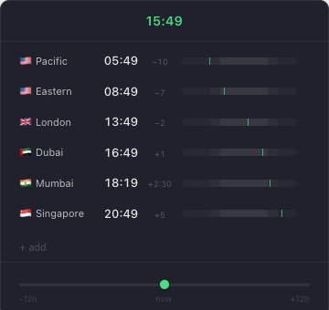

<div align="center">

# ZoneBar

**Stop doing timezone math in your head.**

A macOS and Windows tray app that shows the time everywhere you care about.

[](LICENSE)
[](https://github.com/yazinsai/zonebar/releases/latest)
[](https://github.com/yazinsai/zonebar/releases/latest)
[](https://github.com/yazinsai/zonebar/releases/latest)
[](https://github.com/yazinsai/zonebar/releases/latest)

<br />

<a href="https://github.com/yazinsai/zonebar/releases/latest">
  
</a>
&nbsp;
<a href="https://github.com/yazinsai/zonebar/releases/latest">
  
</a>

<br /><br />



</div>

---

## What it does

Click the clock in your menu bar. See the time in every zone you've added — with relative offsets, day/night context, and a slider to scrub ±12 hours. Click any time to type a specific one and watch everything adjust.

## Install

**macOS**
1. [Download the DMG](https://github.com/yazinsai/zonebar/releases/latest)
2. Drag ZoneBar to Applications
3. Launch — look for the clock in your menu bar

**Windows**
1. [Download the MSI installer](https://github.com/yazinsai/zonebar/releases/latest)
2. Run the installer
3. Launch ZoneBar — look for the clock icon in the system tray (bottom-right)

## Features

- **One click** — lives in the menu bar, always a click away
- **Drag to compare** — slider scrubs ±12h, all zones update live
- **Click any time to edit** — type "3pm" or "15:00" on any zone, everything adjusts
- **Relative offsets** — shows +3, −5, +5:30 instead of verbose timezone names
- **Day boundaries** — shows +1d / −1d when a zone crosses midnight
- **Add, remove, reorder** — customize your zones, drag to arrange
- **Remembers everything** — your setup persists between launches

## Defaults

Pacific · Eastern · London · Dubai · Mumbai · Singapore

## Build from source

```bash
git clone https://github.com/yazinsai/zonebar.git
cd zonebar
npm install
npm run tauri dev
```

Requires [Rust](https://rustup.rs/) and [Node.js 22+](https://nodejs.org/).

## Stack

[Tauri v2](https://tauri.app) · React · TypeScript · Tailwind CSS — under 5 MB.
